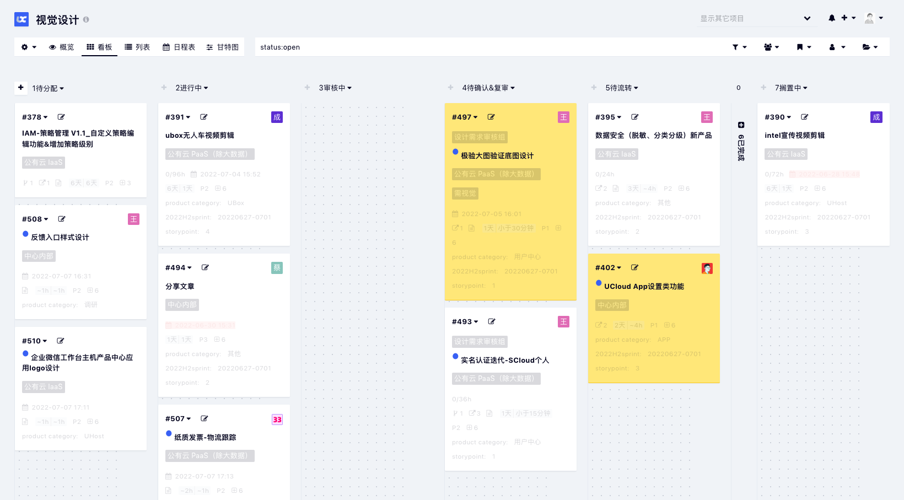

# ThemeRevision for Kanboard
ThemeRevision is a task-first and high quality theme for [Kanboard](https://github.com/kanboard/kanboard). It's also aimed at better mobile experiences, common plugin compatibilities, and customization friendly.

## Screenshots
       

 

## Features
#### 1. Task-first
ThemeRivision has been trying to create a high quality but minimalist UI, help you focus on your tasks.

#### 2. Better mobile experiences
Modern mobile application's interactive behaviour.

#### 3. Common plugins compatibilities
Calendar / Gantt / Group_assign / MetaMagic ...

#### 4. Dark mode

* Users can change the color scheme by themselves (User Profile -> Actions -> Theme Settings)
* Three modes provided: Light / Dark / Auto

#### 5. Customization friendly

* Structured CSS files, easy to locate elements.  
* Utilize "rem" as the global measuring unit.

## Installation
1. Install from the Kanboard plugin manager directly, or `git clone https://github.com/greyaz/ThemeRevision.git` into `your_kanboard_root/plugins`.
2. ThemeRevision use the file `favicon.png` in `your_kanboard_root/assets/img` as the head logo, replace it if needed.

## Customization
1. ***Make sure*** the folder `your_kanboard_root/plugins/ThemeRevision/Asset` is ***writable and executable***.
2. Rename the file `config-default.php` to `config.php`.
3. Enable "development mode" in the configuration file.
4. Edit raw CSS files in the folder `Asset/dev`.

## Author
- greyaz
- License MIT
