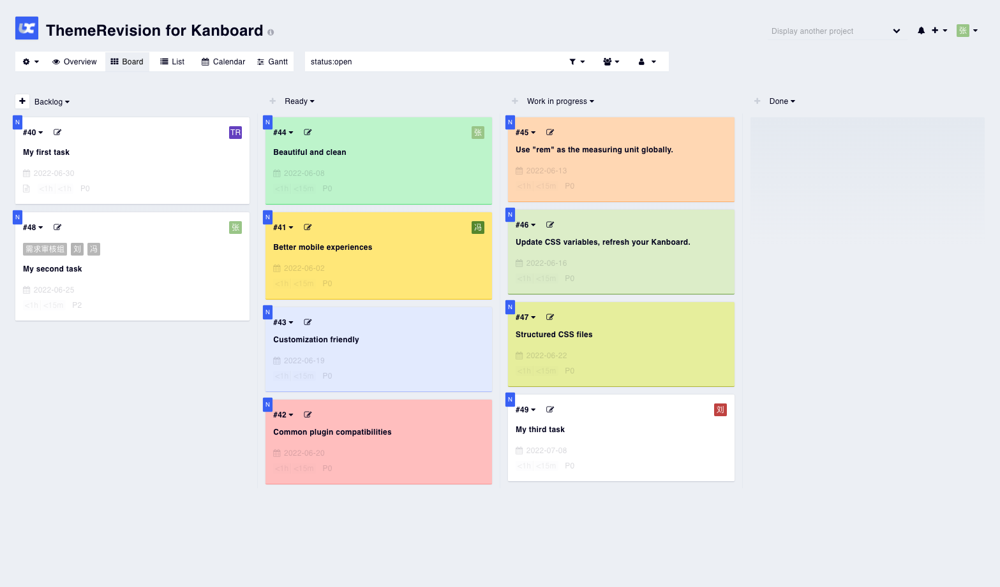
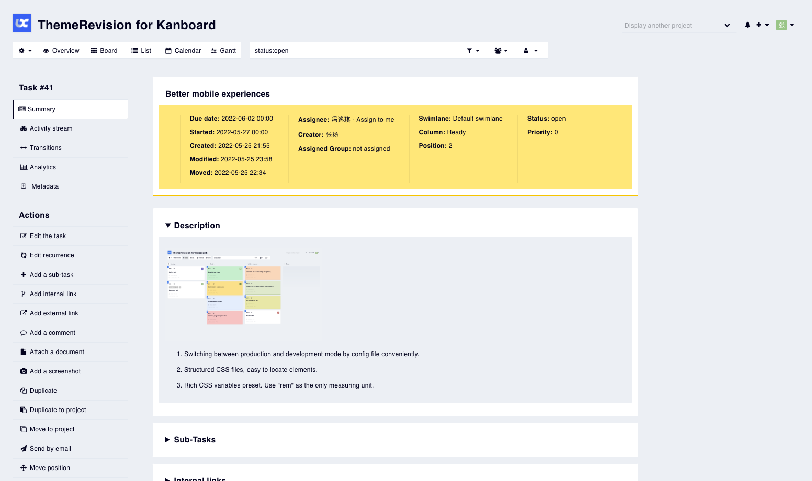
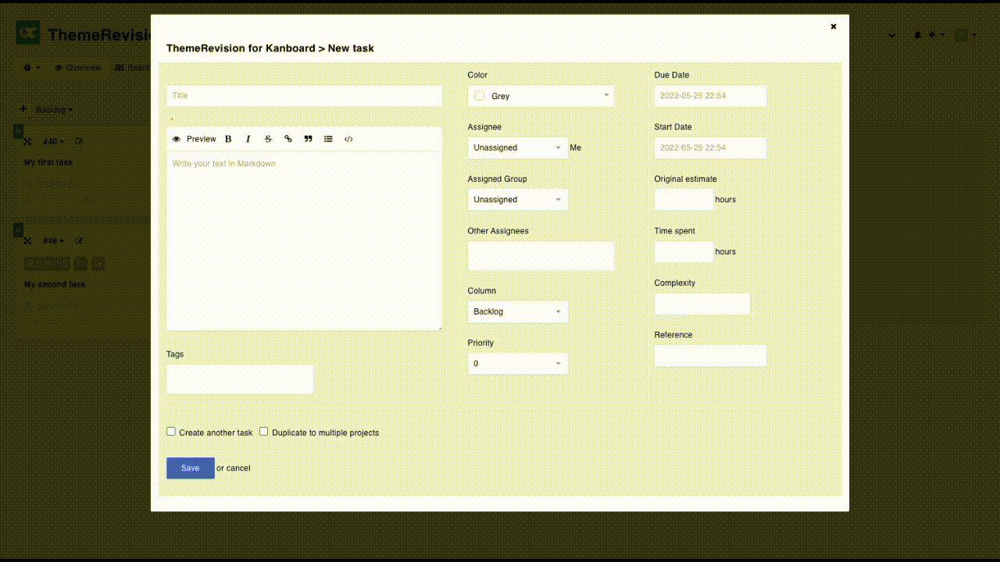
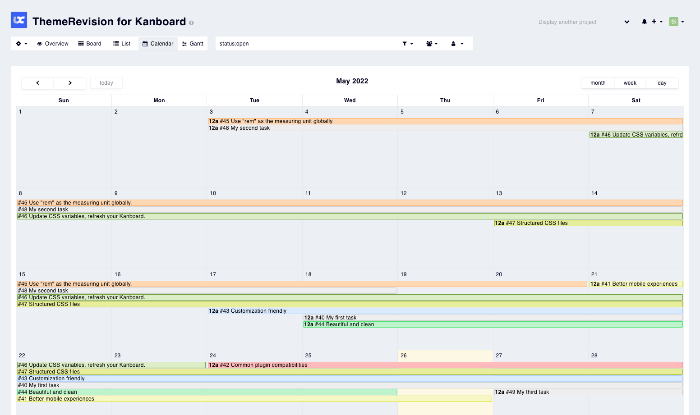
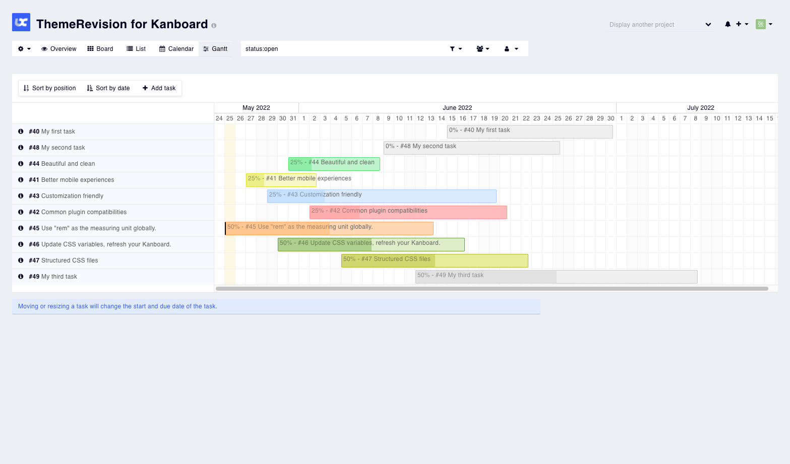
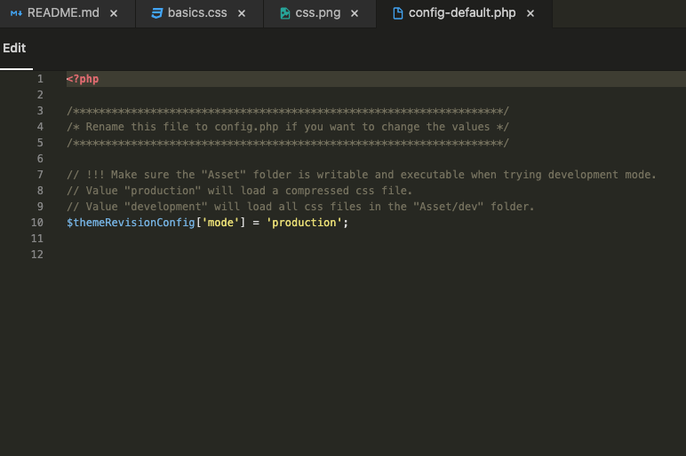
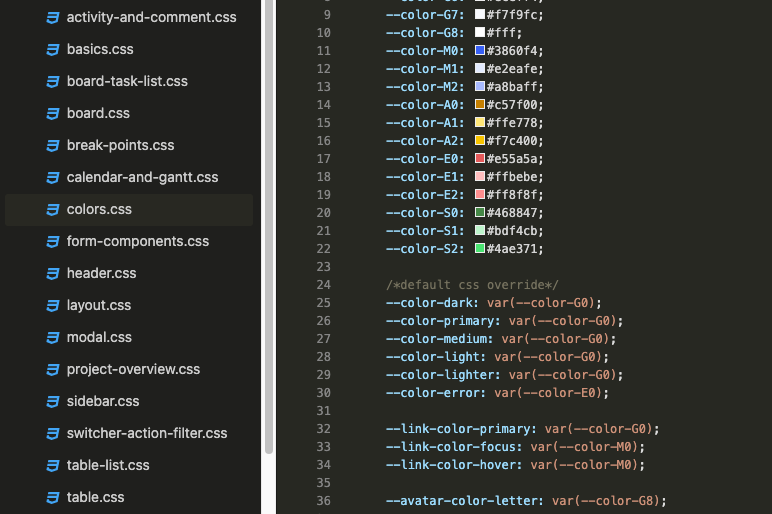

# ThemeRevision for Kanboard
ThemeRevision is a clean and high-quality theme for Kanboard. It's aimed at better mobile experiences, common plugin compatibilities, and customization friendly.

## Better mobile experiences

## Common plugin compatibilities
Calendar / Gantt / Group_assign ...

## Customization friendly
1. Switching between production and development mode conveniently.  
2. Structured CSS files, easy to locate elements.  
3. Rich CSS variables preset. Use "rem" as the global measuring unit.

## Installation
1. Install from the Kanboard plugin manager directly, or `git clone https://github.com/greyaz/ThemeRevision.git` into `your_kanboard_root/plugins`.
2. Upload a file `logo.png` into `your_kanboard_root/assets/img` to change the logo.

## Customization
1. ***Make sure*** the folder `your_kanboard_root/plugins/ThemeRevision/Asset` is ***writable and executable***.
2. Rename the file `config-default.php` to `config.php`.
3. Enable "development mode" in the configuration file.

## Author
- greyaz
- License MIT
