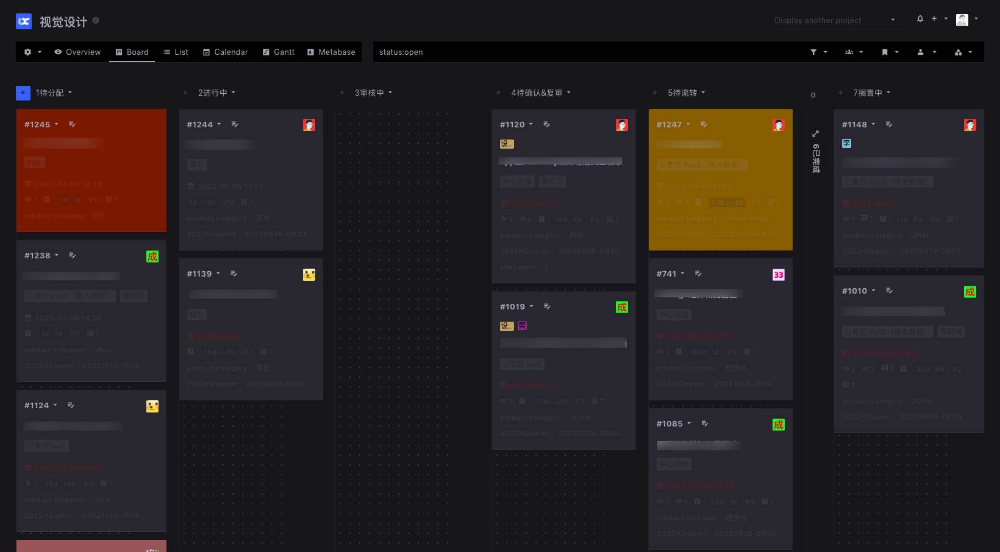
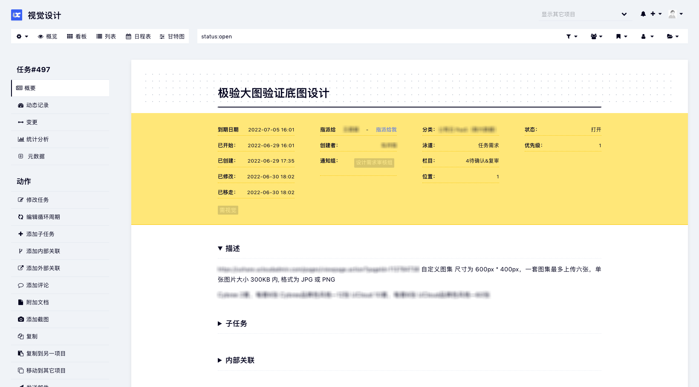
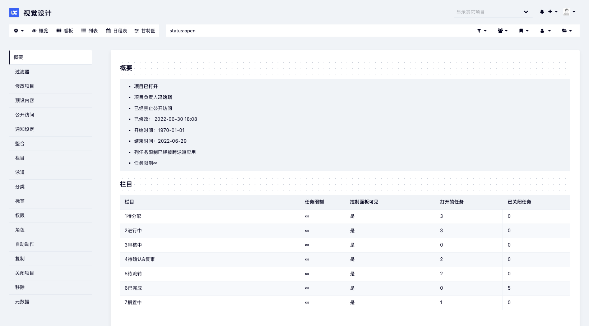
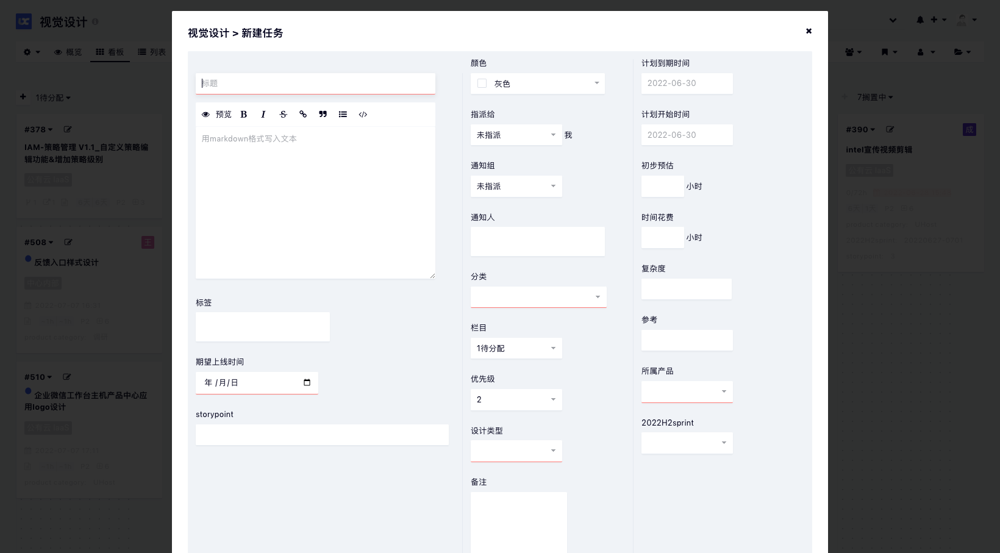
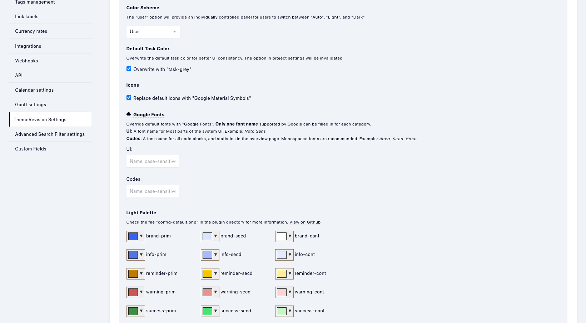
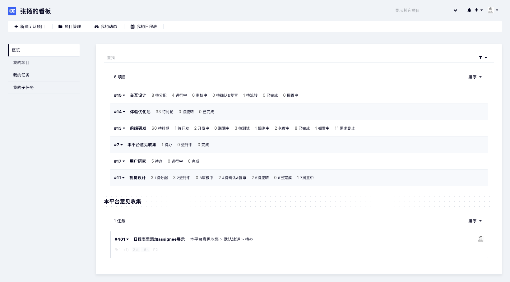
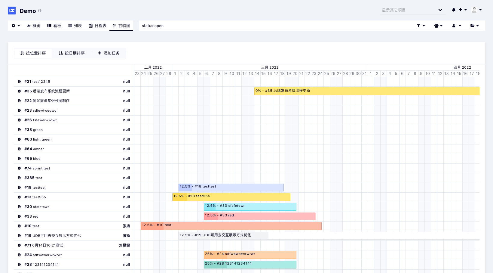
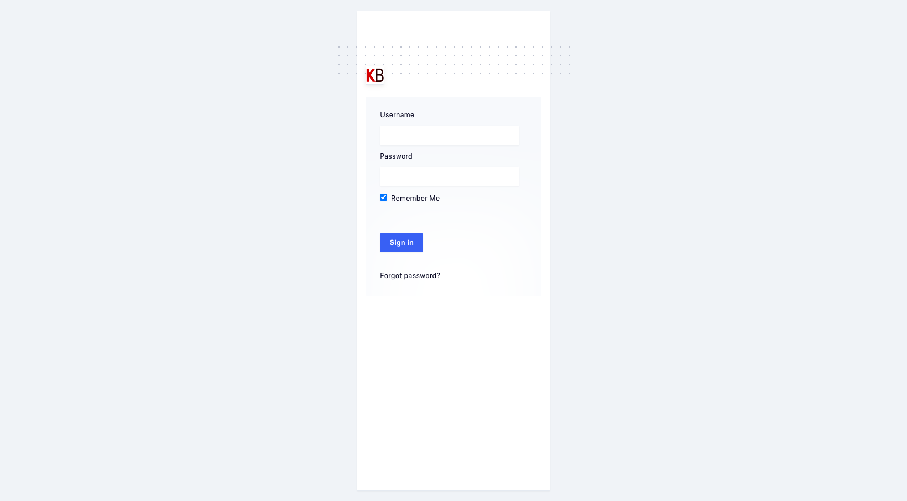
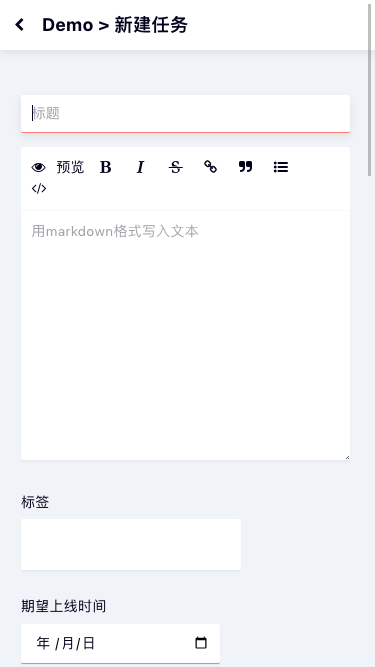
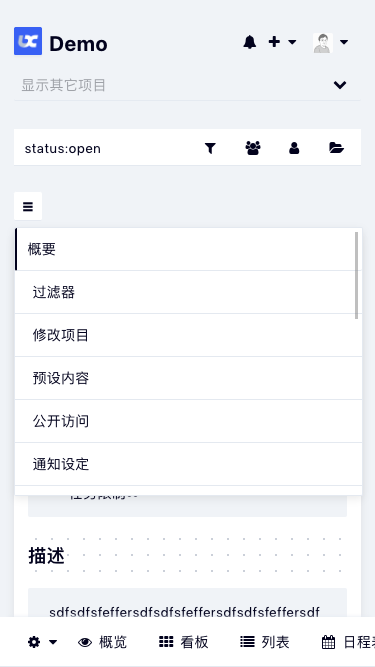

# ThemeRevision for Kanboard

ThemeRevision is a task-first and high quality theme for [Kanboard](https://github.com/kanboard/kanboard). It's also aimed at better mobile experiences, common plugins' compatibilities, and customization friendly.

## Screenshots
 

         

## Features
#### Task-first
* ThemeRivision has been trying to create a high quality but minimalist UI, helps you focus on your tasks.
* Provide support for syntax highlighting

#### Better mobile experiences
* Modern mobile application's interactive behaviour. [screenshot1](Screenshots/10.png) [screenshot2](Screenshots/11.png)

#### Common plugins' compatibilities
* Calendar / Gantt / Group_assign / MetaMagic / MarkdownPlus ...

#### Dark mode
* An individually controlled panel for non-administrative users
* Three modes provided: Light / Dark / Auto

#### Customization friendly

* All colors are configurable in the settings panel. [screenshot](Screenshots/5.png)
* Support Google fonts by just typing a font name.
* Switchable icon packages, _Google Material_ (default) and _Font Awesome_.
* Structured CSS files, easy to locate elements.  
* Utilize "rem" as the global measuring unit.

## Installation
* Install from the Kanboard plugin manager directly.  
   > **or**  
   > `git clone https://github.com/greyaz/ThemeRevision.git` into `your_kanboard_root/plugins`.
* ***Your own logo?***  
ThemeRevision utilize the file `favicon.png` in `your_kanboard_root/assets/img` as the head logo, replace it if needed.

## Upgrading
* ***I have customized CSS files***  
Back up those CSS files you've customized in the folder `Asset/dev` before upgrading.

   > **and (< 1.1.4)**
   > * ***I have customized configs in Kanboard's settings panel***  
   > Export and then reset your configs in the settings panel before upgrading
   > 
   > * ***I have the file `config.php` on my server***  
   > Rename the file to `config.php.bak` before upgrading

## Customization
#### Colors / Icons / Fonts
* Just go to the [settings panel](Screenshots/5.png): *`Settings -> ThemeRevision Settings`*   
   > **or (< 1.0.9)**  
   > Copy and move (**do not delete**) the file `config-default.php` to `config.php` in the plugin directory. Then edit the values according to the instructions in it.

#### More Styles
1. ***Make sure*** the folder `your_kanboard_root/plugins/ThemeRevision/Asset` is ***writable and executable***.
2. Switch "Mode" to "Development" in the [settings panel](Screenshots/5.png).   
   > **or (< 1.0.9)**  
   > Switch "Mode" in the config file according to the alternative method mentioned in the previous section.
3. Edit raw CSS files in the folder `Asset/dev`.

## Author
- greyaz
- License MIT
